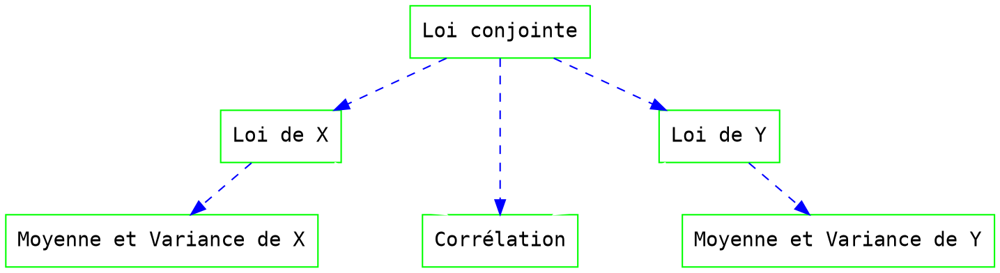

# 0 - Fondements mathématiques pour l'IA (Science des données - MS Big Data)

Ceci n'est pas un cours, seulement un rappels de mathématiques élémentaires pour le cours science des données.

Ces notes ne contiennent pas la totalité de ce qui est fait en cours. Il s'agit d'une petit résumé très partiel des explications données en cours sur les notions d'espérance mathématique, d'estimation de cette espérance par une moyenne empirique, de variance et d'estimateur empirique de la variance, avec extension aux variables à plusieurs dimensions, notion de vecteur moyen, notion de matrice de covariance, cas particulier de la loi normale.

La deuxième partie contient des rappels très brefs d'algèbre linéaire.

# Probabilités et statistiques

## Variables aléatoires discrètes

### Variables aléatoires discrètes uniformes - Dénombrement

Le cas le plus élémentaire en probabilité est celui d'une variable aléatoire (v.a.) qui peut prendre un nombre fini d'états avec la même probabilité. 

Dans ce cas, pour connaître la probabilité d'un événement, il suffit de dénombrer les cas favorables (c'est-à-dire qui appartiennent à l'événement) et de calculer le ratio sur le nombre de cas possibles.
Une v.a. qui peut prendre chacun de ses états avec la même probabilité est appelée variable aléatoire uniforme.

Au-delà du dénombrement, il faut considérer que chacune des issues possibles de l'expérience aléatoire apparaît avec une certaine probabilité a priori $p_j$.

### Loi d'une v.a.

Soit une v.a. $X$ à $N$ états $x_1,\ldots, x_{N}$ ($x_j \in \mathbb{R}$) de probabilités $p_1,\ldots, p_{N}$ où les $p_j$ sont des réels positifs, éventuellement nuls pour certains, qui somment à $1$ : $p_{j}>0$ et $\sum p_j=1$.

$\mathcal{P}=\{p_1,\ldots,p_{N}\}$ est la **loi de la v.a.** $X$.

Pour une v.a. uniforme $p_j = \frac 1N, i=1\cdots N$.

Lorsque l'on connaît la loi d'une variable aléatoire, on connaît tout sur elle. Ceci est rarement possible dans certaines applications et l'on se contente alors de connaissances plus partielles comme celle des moments.

Les moments les plus utilisés sont les moments d'ordre 1 et d'ordre 2. Le moment d'ordre 1 est appelé la moyenne ou espérance mathématique. Le moment d'ordre 2 centré est appelé variance.

L'espérance d'une fonction $f$ de la v.a. $X$ s'écrit $$\mathbb{E}f(X)=\sum_{j=1}^N p_j\,f(x_j)$$

### Espérance mathématique ou moyenne

L'espérance mathématique, moment d'ordre 1, est définie de la manière suivante : $$\mu = \mathbb{E} X=\sum_{j=1}^N p_j\,x_j$$

### Variance ou moment d'ordre 2 centré

Le moment d'ordre deux est défini de manière analogue au moment d'ordre un : $$\mathbb{E}X^2=\sum p_j x_j^2.$$

On s'intéresse souvent au moment d'ordre deux de la variable aléatoire centrée, c'est-à-dire au moment d'ordre deux de la variable aléatoire à laquelle sa moyenne a été retranchée, cette quantité est appelée variance, elle s'écrit : $$Var(X)=\mathbb{E}(X-\mathbb{E}X)^2=\sum p_j(x _j-\mu)^2$$

On vérifie facilement que $$Var(X)=\mathbb{E}(X^2)-(\mathbb{E}X)^2$$

L'écart type, homogène à la v.a. elle même, est défini par : $$\sigma_X = \sqrt{\mbox{Var} \{ X \}}$$

### Entropie
Un autre sous produit de la loi : l'entropie de Shannon, une mesure d'incertitude *a priori* sur les réalisations de la v.a. X. Elle est définie par $$H(X) = - \sum_{j=1}^N p_j \log_2 p_j$$

Son unité de mesure est le bit d'information. 
Elle vaut $0$, sa valeur minimale, pour des lois déterministes (qui concentrent toute la masse de probabilité sur un seul des états) et $\log_2 N$, sa valeur maximale, pour la loi uniforme. 

Une approximation quadratique de l'entropie est fournie par le critère de Gini (utilisé par exemple pour choisir le seuil des classifieurs de type stump).

## Variables aléatoires discrètes à nombre infini d'état

L'extension à $N$ non fini ne pose pas vraiment de problème. 

Notons que cette situation est une modélisation utile, par exemple pour une expérience aussi simple que le lancer d'un pièce jusqu'à obtenir face. 

## Variables aléatoires continues

Une v.a. à valeurs réelles continue à densité est définie par sa densité de probabilité (d.d.p.), la probabilité d'un ensemble est la somme de la densité sur cet ensemble. La somme sur $\mathbb{R}$ tout entier vaut $1$.

Attention : une d.d.p. n'est pas une probabilité, elle peut prendre des valeurs supérieures à $1$. 

Pour une v.a. continue de d.d.p. $p(x)$, le moment d'ordre 1 s'écrit : $$\mathbb{E}X  = \int_{\mathbb{R}} x.p (x) \mbox{dx}$$

le moment d'ordre 2 : $${\mathbb{E}X^2}  = \int_{\mathbb{R}} x^2 .p (x) \mbox{dx}$$

et la variance : $$\mbox{Var} (X) = \mathbb{E}(X-\mathbb{E}X)^2=\mathbb{E} (X^2)-(\mathbb{E}X)^2.$$

L'extension de l'entropie en continu n'est pas si simple ...

## Inégalité de Bienaymé-Tchebychev et fonctions d'erreur

Il est souvent utile d'obtenir des bornes qui sont liées à la manière dont une v.a. s'écarte de sa moyenne. Nous donnons ici un exemple pour deux types de bornes : 
- Une borne valable pour toute loi, intéressante dans la cadre de l'apprentissage statistique. 
- Une borne plus précise mais seulement valable pour une loi normale. 

### Inégalité de Bienaymé-Tchebychev

Pour tout $\alpha>0$
$$
\mathbb{P}\left(\left|X-\mathbb{E}[X]\right| \geq \alpha \right) \leq \frac{\sigma^2}{\alpha^2}\
$$

La probabilité que $X$ s'éloigne de plus de $\alpha$ de son espérance décroît donc lentement, en $1/\alpha^2$. L'intérêt de ce résultat réside dans le fait qu'il est vrai pour toute loi qui possède des moments d'ordre un et deux. 

### Fonction d'erreur pour les lois normales

Lorsque la loi de la v.a. $X$ est connue, il est possible d'otenir des bornes plus précises. 

Par exemple pour une loi normale $X \thicksim \mathcal{N} (\mu, \sigma^2)$ de d.d.p. $p(x)=\frac{1}{\sigma\sqrt{2 \pi}} \exp \left[- \frac{(x - \mu)^2}{2\sigma^2}\right]$, on a : 

$$
\mathbb{P}\left(\left|X-\mathbb{E}[X]\right| \geq \alpha \right) 
= \mathbb{P}\left(\|\mathcal{N}(0,\sigma^2)\| \geq \alpha \right)
$$
C'est-à-dire 
$$
\mathbb{P}\left(\left|X-\mathbb{E}[X]\right| \geq \alpha \right) =
2\int_{\alpha}^{+\infty} \frac{1}{\sigma\sqrt{2 \pi}} 
\exp \left[- \frac{t^2}{2\sigma^2}\right] dt = 2 Q\left(\frac{\alpha}{\sigma} \right)
$$
où $Q$ est la fonction d'erreur définie par 
$$
Q(\alpha) = \int_{\alpha}^{+\infty} 
\frac{1}{\sqrt{2 \pi}} \exp \left[- \frac{t^2}{2} \right] dt
$$
Cette fonction décroît beaucoup plus rapidement qu'en $1/\alpha^2$.

Remarque : souvent la fonction d'erreur est définie par 
$$
{\rm erf}(x) = \frac{2}{\sqrt{\pi}} \int_0^x e^{-t^2} dt
$$

La fonction de répartition de la loi normale centrée réduite s'écrit 
$$
\Phi(\alpha) = \int_{-\infty}^\alpha \frac{1}{\sqrt{2 \pi}} \exp \left[- \frac{t^2}{2} \right] dt = 1 - Q(\alpha)
$$ 

La fonction ${\rm erf}$ est liée à $\Phi$ par 
$$
{\rm erf}(\alpha) = 2 \Phi (\alpha\sqrt{2}) - 1
$$

## Extension à deux variables aléatoires

Lorsque l'on dispose de deux variables aléatoires, il est possible de tout connaître sur l'une et sur l'autre sans rien connaître sur le lien qui les unit : la nouveauté, en dimension plus grande que un, réside dans le fait qu'il est nécessaire de comprendre la dépendance entre les variables.

Définissons les v.a. centrées $\tilde{X} = X -\mathbb{E}X=X-\mu_X$ et $\tilde{Y} = Y -\mathbb{E}Y = Y - \mu_Y$.

On a toujours $$\mathbb{E} (X+Y)=\mathbb{E} (X)+\mathbb{E}(Y)$$.

### Dépendance

Les deux v.a. sont indépendantes si la loi conjointe factorise en ses marginales.

En discret $Pr(x,y)=Pr(x)Pr(y)$ pour tout $(x,y)$. 

De même pour des v.a. continues à densité, deux v.a. sont indépendantes si la densité conjointe $p_{X,Y}(x,y)=p(x,y)$ est le produit de ses marginale $p_{X}(x)=p(x)$ et $p_{Y}(y)=p(y)$, c'est-à-dire  : $p(x,y)=p(x)p(y)$ pour tout $x,y$.

### Corrélation

La corrélation est définie par $$\mathbb{E}(X-\mu_X)(Y-\mu_Y)= \mathbb{E} (\tilde{X}\tilde{Y})$$

Cette quantité dépend de l'amplitude des variations de $X$ et $Y$. 

Pour construire une quantité indépendante de ces amplitudes il est possible de normaliser (inégalité de Cauchy-Schwarz), on définit ainsi le coefficient de corrélation $$\rho = \frac{\mathbb{E} (\tilde{X} \tilde{Y})}{\sigma_X \sigma_Y} \in [-1,+1]$$

Une corrélation de module proche de $1$ est forte, de module proche de $0$, elle est faible. 

Espérance et variance d'une somme de deux v.a. $X,Y$ : lorsque $X,Y$ sont décorrélées ($\rho=0$), a fortiori indépendantes, on a $$\mbox{Var}(X+Y)=\mbox{Var}(X)+\mbox{Var}(Y)$$.

### Indépendance et décorrélation 

Décorrélation et indépendance sont des notions différentes.

-- L'indépendance implique toujours la décorrélation.

-- Sauf cas particulier, la décorrélation n'implique pas l'indépendance.

Voici quelques exemples pour illustrer ces points. 

#### Dépendantes et décorrélées.

Soit $X$ une variable aléatoire de loi uniforme sur l'intervalle $[-1,+1]$ et $Y = 1/5-X^4$.

$Y$ est une fonction de $X$, elle est donc totalement dépendante de $X$ : lorsque l'on connaît $X$ on connaît aussi $Y$. 

On note $\sigma^2=\mbox{Var}X$.

+ $\mathbb{E}(X)=0$, $X$ est centrée.

+ $\mathbb{E}(Y)=\mathbb{E}(1/5-X^4)=1/5-\mathbb{E}(X^4)=1/5-1/5=0$, $Y$ est également centrée.

Quelle est le coefficient de corrélation entre $X$ et $Y$ ?
$$
\rho = \frac{\mathbb{E} (\tilde{X} \tilde{Y})}{\sigma_X \sigma_Y} = 
 \frac{\mathbb{E}(X(1/5-X^4))}{\sigma_X \sigma_Y} = \frac{1/5\mathbb{E}(X)-\mathbb{E}(X^5))}{\sigma_X \sigma_Y}  = 0
$$
La v.a. $Y$ est totalement dépendante de $X$ (c'est une fonction de $X$) et pourtant totalement décorrélée de $X$.

#### Dépendantes et totalement correlées, lien linéaire

La corrélation mesure le lien linéaire entre deux v.a.

Soient 
* $X$ une variable aléatoire de loi uniforme sur l'intervalle $[-1,+1]$. On note $\sigma^2=\mbox{Var}X$. On a $\mathbb{E}(X)=0$ ($X$ est centrée). 
*  $Y=aX+b$, où $a\neq 0$ et $b$ sont deux réels. On a $\mathbb{E}(Y)=\mathbb{E}(aX+b)=a\mathbb{E}(X)+b=b$ ($Y$ est de moyenne $b$).

$Y$ est totalement dépendante de $X$, quelle est la corrélation entre $X$ et $Y$ ?
$\mathbb{E}(\tilde{X}\tilde{Y})=\mathbb{E}(X(Y-b))=a\mathbb{E}(X^2)=a\sigma^2$ d'où le coefficient de corrélation 
$$
\rho = \frac{\mathbb{E} (\tilde{X} \tilde{Y})}{\sigma_X \sigma_Y} = 
 \frac{a\sigma^2}{\sigma |a|\sigma} =
 \frac{a}{|a|} = \mbox{sign}(a) \in \{-1;+1\}
$$
Deux v.a. $X$ et $Y$ liées linéairement sont totalement correlées, $\rho = 1$, ou anticorrélées $\rho = -1$.

#### Lien linéaire approché

Soit $X$ une variable aléatoire de loi uniforme sur l'intervalle $[-1,+1]$ et $Y=aX+b$,
où $a$ est un réel et $b$ une v.a. centrée, indépendante de $X$ et de variance $\sigma_b^2$.
On note $\sigma^2=\mbox{Var}X$. On a $\mathbb{E}(X)=0$, $X$ est centrée, et $\mathbb{E}(Y)=\mathbb{E}(aX+b)=0$, $Y$ est centrée.
Quelle est la corrélation entre $X$ et $Y$ ?
$\mathbb{E}(\tilde{X}\tilde{Y})=\mathbb{E}(X(aX+b))=a\mathbb{E}(X^2)+\mathbb{E}(bX)=a\sigma^2$ d'où le coefficient de corrélation 
$$
\rho = \frac{a\sigma^2}{\sigma( a^2\sigma^2+\sigma_b^2 )^{1/2}} = 
 \mbox{sign}(a)\left({1+\frac{\sigma_b^2}{a^2\sigma^2}}\right)^{-1/2} 
$$
Lorsque $\sigma_b \rightarrow 0$, on retourve la corrélation totale ($\pm 1$), lorsque la variance du bruit croît, la corrélation décroît (en module). 

Ces résultats peuvent être vérifiés par simulation, en Julia par exemple :

`using Statistics, Plots`
`n = 1000;`
`a = 5.;`
`σ_b = 1.; `
`b = σ_b*randn(n);`
`x = 2*rand(n)-ones(n); σ = sqrt(4/12);`
`y = a*x + b;`
`scatter(x,y, label=false)`
`ρ = a/sqrt(1+(σ_b)^2/(a^2*σ^2))`
`ρest = sign(a)/sqrt(1+var(b)/(a^2*var(x)))`

#### Exercice

Etudier la dépendance et la décorrélation des v.a. $X=\sin(\theta)$ et $Y=\cos(\theta)$ où $\theta$ est une v.a. uniforme sur $[0,2\pi)$.

### Au delà de la corrélation

Les exemples ci-dessus monrent les limites de la corrélation en tant que mesure de dépendance entre v.a.. 
La corrélation ne mesure que les liens linéaires et des liens forts peuvent lui échapper entièrement. 

Une mesure plus efficace, mais également plus difficile à mettre en oeuvre est fournie par l'information mutuelle, la divergence de Kullback-Leibler entre la loi conjointe et le produit de ses marginales.  $$I(X;Y) = \sum_x \sum_y p(x,y) \log \frac{p(x,y)}{p(x)p(y)}$$

C'est une mesure d'éloignement entre la loi conjointe et le produit des marginale. La loi conjointe coincide avec le produit des marginales pour des v.a. indépendantes, sinon cette expression donne une mesure de leur éloignement autrement dit une mesure de dépendance. 

+ L'information mutuelle est la divergence de Kullback entre deux lois : la loi conjointe $p(x,y)$ et le produit $q(x,y)=p(x)p(y)$ des marginales $p(x)$ et $p(y$) qui est également une loi. En effet :
$\sum_x p(x)p(y) = p(y) \sum_x p(x)=p(y)$, de même $\sum_y p(x)p(y) = p(x)$, $\sum_x \sum_y p(x)p(y) = \sum_y p(y) \sum_x p(x) = \sum_y p(y) =1$. 

## Estimation

### Estimation de la loi

- En discret. Les quantités a priori $p_j$ peuvent être estimées a posteriori à partir de $k$ réalisations indépendantes de la v.a. $X$. Il suffit pour cela de calculer la fréquence empirique d'apparition de chacun des états (nombre d'occurences d'un état sur nombre de
réalisations).
- En continu. En partitionant les valeurs que peut prendre la v.a., il est possible de se ramener au problème discret précédent, c'est la construction d'un histogramme. 

L'estimation d'un histogramme est efficace en petite dimension mais devient très rapidement problématique et il faut contraindre le problème pour espérer le résoudre de manière satisfaisante. 

### Estimation de paramètres 

Les données observées sont tirées selon une loi qui dépend de paramètres. 

L'estimation de paramètres à partir des données est abordée maintenant.

Un estimateur est une fonction des données observées, celles-ci étant aléatoires, l'échantillon est aussi une variable aléatoire qui doit être la plus proche possible, en un sens à préciser, du paramètre que l'estimateur est censé approcher. 

Nous ne donnons ici que deux exemples : l'estimation de l'espérance et de la variance. 

### Estimation de la moyenne

Lorsque l'on dispose de $k$ réalisations indépendantes $X_j$ de la variable aléatoire X, il est possible d'estimer cette espérance par une moyenne empirique, celle-ci s'écrit : $$\hat{\mu}_k = \frac{1}{k} \sum_{j=1}^k X_j$$

Notons que cette somme pourrait être réordonnée pour grouper ensemble les termes égaux à une même valeur et ainsi faire apparaître les fréquences empiriques de chacun des états ; fréquences empiriques qui se rapprochent des probabilités a priori lorsque la taille de l'échantillon utilisé augmente ; établissant ainsi le pont entre la formule théorique de l'espérance et la formule empirique. 

$\hat{\mu}_k$ est un estimateur de l'espérance mathématique, c'est une fonction des valeurs observées, ces valeurs étant aléatoires le résultat obtenu est également une variable aléatoire.

Comme toute variable aléatoire cet estimateur peut être caractérisé par son espérance mathématique $\mathbb{E}\hat{\mu}_k$. La différence entre cette espérance mathématique et la vraie valeur $\mathbb{E}X$ est appelé le biais : $$b =\mathbb{E}\hat{\mu}_k-\mu$$

Un estimateur dont le biais est nul est dit estimateur non biaisé ou sans biais. Cette propriété est souvent souhaitable en pratique, elle signifie que la valeur estimée coincide en moyenne avec la valeur vraie.

Propriété de l'estimateur empirique de la moyenne : 
Biais de la moyenne empirique 
$$\mathbb{E}\hat{\mu}_k 
= \frac{1}{k} \sum_{j=1}^k \mathbb{E}X_j
= \frac{1}{k} \sum_{j=1}^k \mu = \mu$$
L'estimateur est non biaisé. 
 
Variance de la moyenne empirique $$
\begin{array}{lll}
\mbox{Var} \,\hat{\mu}_k & = & \mathbb{E} \left(\frac{1}{k} \sum_{j=1}^k (X_j-\mu)\right)^2 \\
 &= & \frac{1}{k^2} \left(\sum_{i=j} 
 \mathbb{E}((X_i-\mu)^2)+\sum_{i\neq j} \mathbb{E}((X_i-\mu)(X_j-\mu))\right)
\end{array}
$$

Pour $i\neq j$, les v.a. centrées $X_i-\mu$ et $X_j-\mu$ sont décorrélées, on a $\mathbb{E} (X_i-\mu)(X_j-\mu)=0$, d'où 
$$
\mbox{Var} \,\hat{\mu}_k = \frac{1}{k^2} 
\mathbb{E} \left[ \left(\sum_{j=1}^k (X_j-\mu)\right)^2 \right]
= \frac{1}{k^2} \sum_{j=1}^k \mbox{Var}(X_j)
$$
Les $X_j$ sont toutes même variance $\sigma^2$ donc
$$
\mbox{Var} \,\hat{\mu}_k = \frac{\sigma^2}{k} \rightarrow^{k\rightarrow\infty} 0
$$

### Estimation de la variance

La variance peut aussi être estimée de manière empirique par : $$\widehat{\mbox{Var}}_k (X) = \frac{1}{k - 1} \sum_{j = 1}^k (X_j - \hat{\mu}_k)^2$$

Exercice : montrer que $\widehat{\mbox{Var}}_k (X)$ est un estimateur sans biais de la variance.

### Remarques sur des méthodes d'estimation

#### Procédure de construction d'un estimateur

Dans ce qui précède, la forme des estimateurs a été fixée a priori, elle n'a pas été déduite de manière systématique par une procédure bien définie. 

Il est possible de construire des estimateurs de manière assez systématique, par exemple avec la méthode du maximum de vraisemblance. 

Il est également possible de calculer des bornes inférieures pour les performances d'un estimateur, par exemple la borne de Cramer-Rao. 

Par exemple, l'estimateur empirique de la moyenne est l'estimateur du maximum de vraisemblance dans le cas gaussien et il atteint la borne de Cramer-Rao, ce qui signifie qu'il n'existe pas de meilleur estimateur pour ce problème. 

#### Compromis biais variance

L'écart entre un paramètre (réel) et sa valeur estimée peut être mesuré par l'erreur quadratique moyenne $\mathbb{E}(\hat{\theta}-\theta)^2$ qui peut s'écrire $$
\mathbb{E}(\hat{\theta}-\theta)^2 =
\mathbb{E}\left( (\hat{\theta}-\mathbb{E}(\hat{\theta})) +
(\mathbb{E}(\hat{\theta}) -\theta) \right)^2 
$$

et ainsi être décomposé en trois termes $$
\mathbb{E}(\hat{\theta}-\mathbb{E}(\hat{\theta}))^2 + \mathbb{E}((\mathbb{E}(\hat{\theta}) -\theta)^2) + 
2 \mathbb{E} \left( (\hat{\theta}-\mathbb{E}(\hat{\theta})) (\mathbb{E}(\hat{\theta}) -\theta) \right)
$$

Dans le dernier terme $(\mathbb{E}(\hat{\theta}) -\theta)$ est une constante qui peut sortir de l'espérance ; ainsi, ce terme est nul car $\mathbb{E} \left( (\hat{\theta}-\mathbb{E}(\hat{\theta})) (\mathbb{E}(\hat{\theta}) -\theta)) \right) = (\mathbb{E}(\hat{\theta}) -\theta)
\mathbb{E} \left(\hat{\theta}-\mathbb{E}(\hat{\theta}) \right)$
et $\mathbb{E} \left(\hat{\theta}-\mathbb{E}(\hat{\theta}) \right)= 
\mathbb{E}(\hat{\theta}) -\mathbb{E} (\mathbb{E}(\hat{\theta}))$.

Finalement 
$$
\mathbb{E}(\hat{\theta}-\theta)^2 = \mathbb{E}(\hat{\theta}-\mathbb{E}(\hat{\theta}))^2 + (\mathbb{E}(\hat{\theta}) -\theta)^2
$$

Le premier terme est la variance de l'estimateur (ses fluctuations autour de sa propre moyenne), le second terme est le carré du biais, un décalage systématique entre la valeur estimée et la vraie valeur. 

Minimiser cette somme, l'erreur quadratique moyenne, c'est réaliser un compromis entre ces deux termes, le biais et la variance. 

## Vecteurs aléatoires : $n$ variables aléatoires

On range les $n$ v.a. $X_1, \ldots ., X_n$ sous forme de vecteur $\mathbf{X}=[X_1,\ldots,X_n]^T$.

Les moments d'ordre 1 et 2 se définissent en $n$ dimensions.

### Moments

Le moment d'ordre 1 de $\mathbf{X}$ est défini par le vecteur $$\mathbf{\mu_X}=\mathbb{E}\mathbf{X}=\mathbb{E}[X_1,\ldots,X_n]^T = [\mathbb{E}X_1,\ldots,\mathbb{E}X_n]^T.$$

Le moment d'ordre 2 est la matrice carrée symétrique $$\Gamma=\mathbb{E}(\tilde{\mathbf{X}}\tilde{\mathbf{X}}^T)$$ où $\tilde{\mathbf{X}}=\mathbf{X}-\mathbf{\mu}_{\mathbf{X}}$ est un vecteur aléatoire centré. 

L'entrée $\Gamma_{ij}$ (ligne $i$, colonne $j$) de $\Gamma$ vaut $\Gamma_{ij} =\mathbb{E}(\tilde{X}_i\tilde{X}_j)$. 

Sur la diagonale apparaissent les variances des composantes $\Gamma_{ii} =\mathbb{E} (\tilde{X}_i^2)=\mbox{Var}(X_i)= \sigma_{X_i}^2$ tandis que les éléments hors diagonale sont des corrélations entre composantes : si $\Gamma$ est diagonale, les composantes sont décorrélées.

### Estimation de la moyenne

On range les $n$ v.a. $X_1, \ldots ., X_n$ sous forme de vecteur $\mathbf{X}=[X_1,\ldots,X_n]^T$.
On note $\mathbf{X}_j$ une réalisation du vecteur aléatoire $\mathbf{X}$

A partir de $k$ réalisations $\mathbf{X}_1\cdots\mathbf{X}_k$, on construit un estimateur de la moyenne : $$\hat{\boldsymbol{\mu}}_k = \frac{1}{k} \sum_{j = 1}^k \mathbf{X}_j$$

### Estimation de la matrice de covariance

$$
\widehat{\mbox{Cov}}_k (X) = \frac{1}{k - 1} \sum_{j = 1}^k (\mathbf{X}_j-\hat{\boldsymbol{\mu}}_k)(\mathbf{X}_j - \hat{\boldsymbol{\mu}}_k)^T
$$

Remarques sur l'estimation de la covariance : 

* L'estimateur est une matrice, son rang vaut au plus $n$. Si le nombre de réalisations est inférieur à la dimension $n$ des données, la matrice de covariance estimée n'est pas de rang colonne complet, elle n'est pas inversible. 
* En grande dimension, la convergence de cet estimateur est problématique.

### Loi normale en dimension 1

Une loi très importante en pratique est la loi normale, la d.d.p. d'une loi normale de moyennne $\mu$ et de variance $\sigma^2$ est de la forme : $$p(x)=\frac{1}{\sigma\sqrt{2 \pi}} \exp \left[- \frac{(x - \mu)^2}{2\sigma^2}\right]$$

On note $X \thicksim \mathcal{N} (\mu, \sigma^2)$ : $X$ suit une loi normale de moyenne $\mu$ et de variance $\sigma^2$.

Il est essentiel de noter que la loi normale $\mathcal{N}(\mu,\sigma^2)$ est entièrement définie par sa moyenne $\mu$ et sa variance $\sigma^2$. Ceci est une propriété très particulière puisqu'en général il est possible de déduire les moments de la densité de probabilité mais que la connaissance des deux premiers moments ne permet pas de remonter à la connaissance complète de la d.d.p. .

### Loi normale en dimension $n$ 

En notant 
+ $\tilde{\mathbf{x}} = \mathbf{x}-\mathbf{\mu}_{\mathbf{x}}$ où $\mathbf{\mu}_{\mathbf{x}}=\mathbb{E} \mathbf{X}$ 
+ $\Gamma =\mathbb{E}(\mathbf{\tilde{X}}\mathbf{\tilde{X}}^T)$ où $\tilde{\mathbf{X}}=\mathbf{X} - \mathbf{\mu}_{\mathbf{X}}$, 

la d.d.p. de $\mathbf{X}$, fonction des $n$ variables $\mathbf{x}=(x_1,\ldots,x_n)$ s'écrit : $$p(\mathbf{x})=\frac{1}{(2\pi)^{n/2}|\mathbf{\Gamma}|^{1/2}} \exp\left[-\frac{1}{2}\tilde{\mathbf{x}}^T\mathbf{\Gamma}^{-1} \tilde{\mathbf{x}} \right]$$

Comme dans le cas scalaire, la densité de probabilité est entièrement définie par les deux premiers moments : vecteur moyen et matrice de covariance.

Remarques : 
* Lorsque la matrice de covariance est diagonale, c'est-à-dire lorsque les composantes sont décorrélées, cette densité de probabilité se factorise en ses marginales.

* Dans le cas général, la dépendance implique la décorrélation. Dans le cas de la loi normale l'inverse est vrai également, c'est-à-dire que la décorrélation implique l'indépendance.

* La matrice de covariance est une matrice symétrique, définie (souvent), positive.

* Cette matrice est diagonalisable. Sa diagonalisation est importante dans beaucoup d'applications car elle permet de voir quelles sont les directions privilégiées dans lesquelles les données se déploient.

### Information mutuelle pour les lois normales 

En général, on a $$I(X;Y) = \sum_x \sum_y p(x,y) \log \frac{p(x,y)}{p(x)p(y)}$$

Pour deux vecteurs conjointement gaussiens : $$I(X;Y)= \dfrac{1}{2} \log \dfrac{ |\Gamma_X| | \Gamma_Y| } { |\Gamma_{XY}| }$$
où 
+ $|\Gamma_{XY}|$ le déterminant de la matrice de covariance de $X$ et $Y$, 
+ $|\Gamma_{X}|$ le déterminant de la matrice de covariance de $X$,
+ $|\Gamma_{Y}|$ le déterminant de la matrice de covariance de $Y$.

# Algèbre linéaire

Dans cette partie, la dimension des espaces est toujours finie. 

## Espace vectoriel 

Un corps $(K,+,\times$) vérifie : 
+ (K,+) est un groupe abélien dont le neutre est $0$, 
+ $\times$ est distributive sur $+$, 
+ $(K^*,\times)$ est un groupe abélien dont le neutre est $1$. 

Un espace vectoriel $E$ sur le corps $K$ est un ensemble d'objets (appelés vecteurs) muni d'une structure qui permet de les sommer et de les multiplier par un scalaire (éléments du corps $K$ sur lequel l'e.v. est construit, les réels dans ce cours).

$E$ est muni de 2 lois :
* L'addition $+$ est une loi de composition interne ($E \times E \rightarrow E$)
* La multiplication $\cdot$ par un scalaire ($K \times E \rightarrow E$) est une loi de composition externe.

telles que

* (E,+) est un groupe abélien (l'addition $+$ vérifie : commutativité, existence d'un élément neutre, existence d'un opposé pour tout élément de $E$ et associativité)
* La loi $\cdot$ est ditributive à gauche par rapport à l'addition $+$ de $E$, c'est-à-dire $\alpha \cdot (v+w) = \alpha \cdot v + \alpha \cdot w$,
* La loi $\cdot$ est ditributive à droite par rapport à l'addition dans le corps $K$, c'est-à-dire $(\alpha+\beta) \cdot v = \alpha \cdot v + \beta \cdot v$,
* L'élément neutre de $K$ est neutre à gauche pour $\cdot$ c'est-à-dire $1.v = v$.
* La loi $\cdot$ est associative par rapport à la multiplication dans $K$ : $(\alpha \beta)v = \alpha (\beta v)$

Un e.v. est donc stable par combinaisons linéaires. 

## Bases et familles génératrice

Une famille de vecteurs est génératrice (d'un e.v. $E$) si tout vecteur de l'e.v. $E$ peut s'écrire comme combinaison linéaire des éléments de cette famille. On note ${\rm span} (v_1,\cdots,v_n)$ l'e.v. engendré par la famille $v_1,\cdots,v_n$. 

Une famille libre est une famille de vecteurs linéairement indépendants, c'est-à-dire qu'aucun élément ne peut s'écrire comme combinaison linéaire des autres.

En dimension $n$, si la famille génératrice $(v_1,\cdots,v_n)$ est libre, c'est une base

Une famille est une base si tout vecteur admet une décomposition unique.

De toute famille génératrice on peut extraire une base.

On peut compléter une famille libre pour former une base. 

## Dimension 

Toutes les bases sont de même taille, la dimension.

Si $V$ est de dimension $n$ et $V = {\rm span} (v_1,\cdots,v_n)$ alors $v_1,\cdots,v_n$ est une base.

Si $U \subset V$ ($U$ s.e.v. de $V$) alors ${\rm dim} U \leq {\rm dim} V$. 

${\rm dim}(U+V) = {\rm dim}(U)+{\rm dim}(V)-{\rm dim}(U \cap V)$

Somme directe $\bigoplus$ : $U+V = U \bigoplus V \Leftrightarrow {\rm dim}(U+V)= {\rm dim}(U) + {\rm dim}(V)$

## Applications linéaires

Une application $T$ de $V$ vers $W$ est linéaire si et seulement si elle 
* additive, c'est-à-dire $T(u+v)= T(u)+T(v)$) et 
* homogène, c'est-à-dire $T(\alpha u) = \alpha T(u)$. 
 
C'est-à-dire $T\left( \sum\alpha_iv_i\right)=\sum\alpha_iT(v_i)$ pour $a_i\in K$ et $v_i \in E$. 

On note $L(V,W)$ ensemble des applications linéaires de $V$ vers $W$. Dans le cas $V=W$ on note $L(V)$.

On a toujours $T(0)=0$

### Sous espaces vectoriels associés à une application linéaire

#### Noyau

Le noyau de $T$, noté ${\rm Ker}(T)$, est l'ensemble des vecteurs de $V$ dont l'image par $T$ vaut $0$ : $${\rm Ker}(T) = \{ u\in V | T(u)=0 \},$$ 

c'est un sous espace vectoriel de $V$ : $T^{-1}(0) = {\rm Ker}(T)$.

${\rm Ker}(T) = \{0\} \Leftrightarrow$ $T$ est injective

#### Image

L'image de $T$, notée ${\rm Im}(T)$, est l'ensemble des vecteurs de $W$ qui possèdent un antécédent dans $V$ : $${\rm Im}(T) = \{ w\in W | \exists v\in V : f(v)=w \},$$ 

c'est un sous espace vectoriel de $W$.

${\rm Im}(T) = W \Leftrightarrow T$ est surjective. Si ${\rm dim}(V)<{\rm dim}(W) \Rightarrow T$ n'est pas surjective.

#### Dimensions du noyau et de l'image

${\rm dim}(V) = {\rm dim}({\rm Ker}(T)) + {\rm dim}({\rm Im}(T))$

$U \subset V$ alors $T(U)$ est un s.e.v. de $W$.
$Z \subset W$ alors $T^{-1}(Z)$ est un s.e.v. de $V$.

### Isomorphisme

$T$ est un isomorphisme s'il existe $S\in L(W,V)$ telle que $S \circ T = Id_V$ et $T \circ S = Id_W$.

## Produit scalaire

Un produit scalaire est une forme bilinéaire symétrique définie positive.

Une norme peut être associée à un produit scalaire. En découlent les notions de  distances et de longueurs. 

### Relations importantes

+ Pour tout scalaire $\alpha$, on a  $$\Vert \alpha v\Vert^2 = |\alpha| \Vert v\Vert^2$$.

+ Inégalité de Cauchy-Schwarz : $$|<v,w>|\leq \Vert v\Vert \cdot \Vert w\Vert$$. 
On a égalité lorsque les vecteurs $v$ et $w$ sont colinéaires.

+ Inégalité triangulaire et théorème de pythagore : $$\Vert v+w\Vert \leq \Vert v\Vert +\Vert w\Vert$$
Si $v \bot w$ ($v$ et $w$ sont orthogonaux, c'est-à-dire $<v,w>=0$), on a $$\Vert v+w\Vert^2 = \Vert v\Vert^2+\Vert w\Vert^2.$$

## Bases orthonormales

Une base est orthogonale si $<v_i,v_j>=0$, pour $i \neq j$, les vecteurs de base sont orthogonaux. 

Si de plus $\Vert v_j\Vert = 1$ (les vecteurs de base sont normés) la base est dite orthonormale. 

## Matrices

### Caractérisation d'une application linéaire

Une application linéaire $T$ de $V$ dans $W$ est entièrement caractérisée par les images des vecteurs d'une base de $V$.

Ainsi les $n$ vecteurs d'une base de $V$, qui ont chacun $n$ coordonnées, et leurs images, qui ont chacune $m$ coordonnées dans une base de $W$ forment un ensemble de $m\times n$ nombres. 

Pour un choix d'une base $B$ de $V$ et d'une base $B'$ de $W$ l'application linéaire peut donc être représentée par une matrice de $m$ lignes, $n$ colonnes, $M_{ij}\in F,i=1\cdots m, j=1\cdots n$. La matrice obtenue est une représentation de l'application linéaire pour ce choix des bases $B$ et $B'$.

$M(m,n,F),+,\cdot)$ est un e.v. : l'ensemble $M(m,n,K)$ des matrices de taille $m\times n$ à éléments dans $K$, muni de l'addition des matrices (addition élément par élément) et d'une multiplication forme un espace vectoriel.

Cas particuliers importants :
* $n=m$ (matrice carrée), 
* $m=1$ (matrice d'une forme linéaire),
* $M_{ij}=0$ pour $i\neq j$ (matrice diagonale), 
* $M_{ij}=0$ pour $i\neq j$ et $M_{ii}=1$ (matrice identité $I$).

Soient $B=(v_1,\cdots,v_n)$ une base de $V$ et $B'=(w_1,\cdots,w_n)$ une base de $W$

L'image d'un vecteur de la base $B$ s'écrit dans la base $B'$ comme $T(v_j)=\sum_{i=1}^m \alpha_{ij} w_i$

### Matrices inversibles

Une matrice carrée $A$ est inversible s'il existe une matrice $B$ telle que $\mathbf{A}\mathbf{B}=\mathbf{B}\mathbf{A}=\mathbf{I}$. L'inverse est unique. 
L'inversibilté est équivalente à $Ker(T) = \{0\}$. L'inversibilité de la matrice est équivalente à celle de l'application linéaire que cette matrice représente. 

### Déterminant

Le déterminant est lié au volume engendré par un ensemble de vecteurs. 
Une matrice est inversible si et seulement si son déterminant est non nul. 

### Diagonalisation d'une matrice carrée réelle symétrique

Une matrice $\mathbf{S}$ réelle carrée symétrique (cas des matrices de corrélation et des matrices de Gram) admet une unique décomposition la forme  $$\mathbf{S} = \mathbf{Q} \mathbf{\Lambda} \mathbf{Q}^T $$
où 
* $\mathbf{Q}=[q_1,\cdots,q_n]$ est une matrice orthonormale dont les colonnes $q_i$ sont les vecteurs propres, elles sont orthogonales et de norme unité.
* $\Lambda$ est une matrice diagonale $\mathbf{\Lambda} = {\rm diag}(\lambda_1, \cdots, \lambda_n)$, les $\lambda_i$ sont les valeurs propres associées aux vecteurs propres $q_i$.

On a donc 
$$
\mathbf{S} = \sum_i \lambda_i \mathbf{q_i} \mathbf{q_i}^T
$$
Notons que $\mathbf{q_i} \mathbf{q_i}^T$ est une matrice de rang colonne $1$, c'est-à-dire que l'espace vectoriel engendré par ses colonnes est de dimension $1$. 

### Forme quadratique

Une forme est une application à valeurs dans $K$ ($\mathbb{R}$ ici). 

On peut définir une forme quadratique à l'aide d'une matrice $\Gamma$ par $$
\mathbf{x} \rightarrow \mathbf{x}^T \mathbf{\Gamma} \mathbf{x} + \mathbf{b}^T\mathbf{x} + c$$
$\mathbf{b}$ est un vecteur et $c$ un scalaire. 

Si $\mathbf{x} = [x_1,\cdots,x_n]$, c'est un polynôme de degré $2$ en les variables $x_i$. 

<!---
#### SVD Décomposition en valeurs singulières

Si $A$ a une matrice de vecteurs propres non inversible , elle n'a pas de décomposition propre. 

Pour une matrice réelle $m \times n$, avec $m>n$ (plus d'équations que d'inconnues), elle peut s'écrire sous une forme appelée décomposition en valeurs singulières (SVD, Singular Values Decomposition). 
$$A = U D V^T$$
U de dimensions $m\times m$ , D de dimensions $m\times n$ et V de dimensions $n\times n$ 

où $U$, $V$ ont des colonnes orthonormales ($UU^T=I$, $VV^T=I$) et $D$ est diagonale. 

Une variante courante consiste à utiliser la décomposition avec U de dimensions $m\times k$ , D de dimensions $k\times k$ et V de dimensions $k\times n$ avec $k=\min(k,m)$.
Si $A$ est singulière, certaines des ses valeurs singulières sont nulles. 
Le rang de $A$ est le nombre de valeurs singulières non nulles. 
La SVD est essentiellement unique (à une permutation des valeurs singulières près, ou si des valeurs singulières sont égales).

La SVD permet beaucoup de choses : 
pseudo-inverse
Approximation de rang faible

:::danger 
Preuve de l'existence
:::spoiler
$A$ est une matrice $m\times n$ de rang $r \leq \min(m,n)$
Les matrice $AA^T$ et $A^TA$ sont symétriques donc diagonalisables. 
Le rang de $A$ est le rang de $AA^T$ et $A^TA$.
De part le théorème spectral, il existe une unique matrice carrée $n\times n$ et une matrice unitaire $V$ telle que 
$$
A^TA = VDV^T
$$
$D$ est diagonale, elle contient les valeurs propres $\lambda_1,\cdots,\lambda_r, \lambda_{r+1}=0, \cdots, \lambda_n=0$.
:::
:::

-->

Références bibliographiques 

Mathematics for Machine Learning
https://mml-book.github.io/

Mathematics for Computer Science
https://ocw.mit.edu/courses/6-042j-mathematics-for-computer-science-spring-2015/mit6_042js15_textbook.pdf